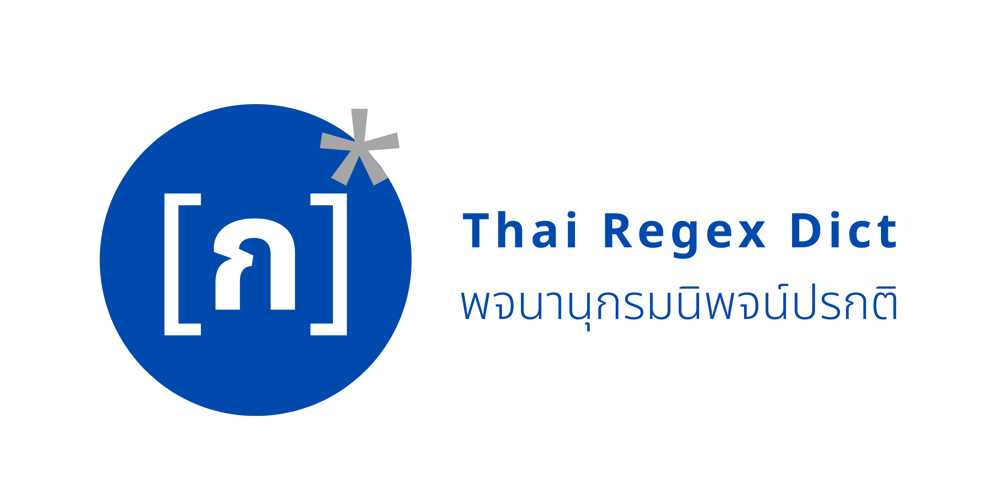

# thai-regex-dict

  <b>Thai Regex Dict | พจนานุกรมนิพจน์ปรกติ</b>
   
  <i>“เมื่อสัมผัสต้องมาก่อนความหมาย”</i>

A simple Thai Regex Dictionary <a href="https://web.dev/progressive-web-apps/">PWA</a> built with <a href="https://github.com/vercel/next.js">Next.js</a>, <a href="https://github.com/chakra-ui/chakra-ui">Chakra UI</a> and ❤️

## Setup

- Clone/fork this repository
- Install dependencies: `yarn` or `npm install`
- Run the development server: `yarn dev` or `npm run dev`

## Support me

